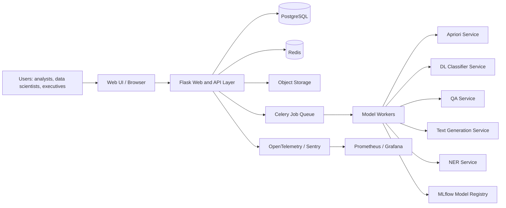

# AI Analytics Hub Production Blueprint

## 1. Executive Summary

The right industry-grade evolution for this project is a modular Flask monolith with clear domain boundaries, background workers for heavy jobs, managed infrastructure for stateful services, and a disciplined MLOps and security layer.

This is the best fit if you want all of the following at the same time:

- A portfolio project that looks professionally architected
- A proof-of-concept that can be shown to clients or investors
- A realistic MVP that can later scale into a larger deployment

For a single developer or small team, jumping straight to microservices would add operational complexity faster than it adds business value. A modular monolith gives you a strong architecture now and leaves room to split services later if usage justifies it.

## 2. Working Assumptions

Because the final priorities were not confirmed yet, this blueprint assumes:

- Industry focus: general analytics with optional tailoring for healthcare, finance, e-commerce, or research
- Primary goal: portfolio plus production-ready MVP
- Team size: 1 to 4 engineers
- Hosting model: cloud deployment with Docker containers and managed database/cache
- Initial scale: 50 to 500 monthly active users, 5 to 20 concurrent inference requests, and CSV uploads up to 250 MB
- Compliance baseline: GDPR-aware and SOC 2-inspired controls, but not full HIPAA or PCI-DSS unless industry requires it

If your actual target is healthcare or finance, keep the same application architecture but raise the security, audit, retention, and infrastructure controls.

## 3. Clarification Decisions That Matter Most

Use these to tailor the blueprint quickly:

| Decision Area | Recommended Default | If You Upgrade the Requirement |
| --- | --- | --- |
| Industry | General analytics | Healthcare adds HIPAA controls; finance adds stronger audit, retention, and access segregation |
| Primary goal | Portfolio + MVP | Investor pitch needs scale narrative; enterprise pilot needs compliance evidence |
| Team size | Single developer or small team | Larger teams can split workers and services earlier |
| Hosting | Azure Container Apps, AWS ECS, or VM-based Docker | On-prem adds secrets, logging, and network complexity |
| Scale | Low to medium traffic | Higher traffic needs model autoscaling and job isolation sooner |

## 4. Recommended Architecture

### 4.1 Architecture Choice

Recommended approach: modular monolith with worker processes.

Why this is the right choice:

- Flask remains the core framework, matching your current project direction
- Blueprints and a service layer keep features separated without early microservice overhead
- Background workers handle training, Apriori mining, and slow inference safely
- You can scale web nodes and worker nodes independently
- It is much easier to build, test, deploy, and explain than a full microservice platform

### 4.2 Architecture Pattern Comparison

| Pattern | Pros | Cons | Recommendation |
| --- | --- | --- | --- |
| Single Flask app only | Simple to start | Blocks on long jobs, hard to scale, weak separation | Too small for industry use |
| Modular Flask monolith + workers | Clean, practical, scalable enough, easiest to maintain | Requires queue and deployment discipline | Best fit |
| Full microservices | Strong isolation, team autonomy | Highest DevOps cost, duplicated concerns, slower delivery | Only after product-market fit |
| Serverless-only | Cheap at low usage, fast to launch | Poor fit for warm model inference and long tasks | Use selectively for batch jobs only |

### 4.3 Target System Layout



### 4.4 Deployment Topology

Minimum professional deployment:

- `web` container: Flask app, Jinja pages, REST API, auth, dashboards
- `worker` container: Celery worker for Apriori, classifier training, batch inference
- `postgres` service: relational data and history
- `redis` service: caching, rate limiting, job broker
- `object storage`: uploaded datasets, generated charts, model artifacts

Scale-out path:

- Add more `web` replicas for concurrent users
- Add CPU workers for Apriori and NER
- Add separate inference workers or GPU workers for QA and text generation if needed

## 5. Production Module Design

### 5.1 Common Cross-Cutting Services

Every module should use the same shared capabilities:

- Authentication and role-based authorization
- Input validation with typed request schemas
- Audit logging for sensitive actions
- Standardized error responses
- Job status tracking
- Model version metadata
- Metrics and traces

### 5.2 Apriori Association Rule Mining

Recommended flow:

1. User uploads CSV
2. File is validated, scanned, and stored in object storage
3. Metadata is stored in PostgreSQL
4. A background job performs preprocessing and Apriori mining
5. Results are stored as structured outputs and charts
6. UI polls job status or receives Server-Sent Events updates

Production improvements:

- Use `mlxtend` for Apriori and association rule generation
- Enforce schema checks, file size limits, delimiter detection, and row count thresholds
- Persist preprocessing reports
- Cache repeated runs on the same cleaned dataset and parameters
- Add export options for CSV and PDF summaries

### 5.3 Deep Learning Classifier

Even though your latest list highlighted four production models, the deep learning classifier should remain in scope because it is part of the original platform value.

Recommended flow:

1. Upload tabular dataset
2. Validate target column and feature types
3. Launch asynchronous training job
4. Track experiment in MLflow
5. Store metrics, confusion matrix, and model artifact
6. Allow prediction using the trained version

Production improvements:

- Replace ad hoc preprocessing with scikit-learn pipelines
- Store training configuration, random seed, and feature mapping
- Add minimum metric thresholds before a model can be promoted
- Support retraining by dataset version, not by loose file name

### 5.4 Question Answering

Required behavior:

- Voice or text question input
- Transformer-based answer extraction
- Text and voice answer output

Recommended production design:

- Capture voice in the browser or through a cloud speech SDK instead of `PyAudio` on the server
- Convert speech to text on the client or via a speech service
- Send normalized text to a QA endpoint
- Return answer text and confidence score
- Use browser speech synthesis or cloud TTS for spoken output

Why this matters:

- Server-side microphone libraries are brittle in web hosting environments
- Browser or managed speech services are far easier to deploy and scale

### 5.5 Text Generation

Recommended production design:

- Keep transformer-based generation, but do not treat raw `gpt2` as the only long-term production choice
- For a local and portable build, use a smaller open model optimized for CPU or ONNX
- For business-facing deployments, consider a managed LLM for better instruction following, safety, and latency control

Guardrails to add:

- Prompt length limits
- Per-user rate limits
- Toxicity or policy filtering
- Output truncation and timeout protection
- Full request and response audit metadata

### 5.6 Named Entity Recognition

Recommended production design:

- Use a Hugging Face token-classification pipeline wrapped behind a service interface
- Store raw text only if business policy allows it
- Add an optional redaction mode for PII-heavy industries
- Persist entities in normalized JSON for search and analytics

Business value add:

- Highlight entities by category
- Allow export of entities as structured JSON or CSV
- Add domain dictionaries later for healthcare or finance

## 6. Revised Technology Stack

### 6.1 Backend and API

- Python 3.11 or 3.12
- Flask with app factory pattern
- Flask blueprints for web and API modules
- SQLAlchemy 2.x
- Alembic for migrations
- Pydantic v2 or Marshmallow for validation
- Flask-Limiter for rate limiting
- Flask-Talisman or equivalent header hardening
- Flask-JWT-Extended or external OAuth provider integration

### 6.2 Data and Storage

- PostgreSQL instead of SQLite for production
- Redis for cache, queue broker, and throttling
- S3, Azure Blob Storage, or MinIO for datasets, charts, and model artifacts

### 6.3 ML and NLP

- pandas, NumPy, scikit-learn
- mlxtend for Apriori
- TensorFlow/Keras for classifier training
- transformers, tokenizers, PyTorch
- optimum and onnxruntime for inference optimization
- MLflow for experiment tracking and model registry
- Evidently for drift and data quality reports

### 6.4 Voice and Frontend

- Bootstrap 5 for responsive UI
- HTMX or lightweight JavaScript for progressive interactivity
- Chart.js or Plotly for visual analytics
- Browser Web Speech API for demo-friendly voice I/O
- Azure Speech, AWS Transcribe/Polly, or Whisper-based services for production speech

### 6.5 Operations

- Gunicorn for Flask serving
- Nginx or cloud ingress controller
- Celery for async jobs
- Docker and Docker Compose for local and staging
- OpenTelemetry instrumentation
- Prometheus and Grafana for metrics
- Sentry for exception tracking
- GitHub Actions for CI/CD

## 7. Enterprise Folder Structure

Recommended structure:

```text
AI_Analytics_Hub/
  README.md
  pyproject.toml
  .env.example
  docker-compose.yml
  alembic.ini
  app/
    __init__.py
    api/
      __init__.py
      routes/
        auth.py
        health.py
        uploads.py
        apriori.py
        classifier.py
        qa.py
        text_generation.py
        ner.py
    web/
      __init__.py
      routes/
        dashboard.py
        auth.py
    core/
      config.py
      extensions.py
      logging.py
      security.py
      errors.py
    domain/
      models/
      schemas/
      enums.py
    services/
      apriori/
      classifier/
      qa/
      text_generation/
      ner/
      datasets/
      storage/
      voice/
    repositories/
    tasks/
    observability/
    templates/
    static/
  migrations/
  docs/
    adr/
  scripts/
  deploy/
    docker/
    nginx/
    k8s/
    terraform/
  tests/
    unit/
    integration/
    e2e/
    performance/
    security/
  data_samples/
```

How this improves your current scaffold:

- Keeps Flask as the center of the application
- Splits API routes from HTML page routes
- Moves business logic into services and repositories
- Makes background jobs first-class citizens
- Prepares the codebase for CI/CD, IaC, and audit-ready documentation

## 8. Updated Functional Requirements

### 8.1 Core Product Requirements

- Users can authenticate and access role-based dashboards
- Users can upload, validate, and manage datasets
- Users can launch Apriori analysis jobs and inspect rules, support, confidence, and lift
- Users can train a deep learning classifier from a tabular dataset
- Users can ask questions by text or voice and receive answer text plus optional speech output
- Users can generate text with configurable parameters and guardrails
- Users can run NER extraction and visualize tagged entities
- Users can review history, status, and artifacts for each job
- Admin users can inspect model versions, job failures, and audit logs

### 8.2 Operational Requirements

- Every long-running task exposes status: `queued`, `running`, `completed`, `failed`
- Every inference request includes traceable metadata: model version, latency, user, timestamp
- Every upload produces a data validation report
- Every promoted model version includes metrics, configuration, and artifact link

## 9. Updated Non-Functional Requirements

### 9.1 Availability and Reliability

- Portfolio/demo target: 99.5% monthly uptime
- Production MVP target: 99.9% monthly uptime
- Daily backups for PostgreSQL and dataset metadata
- Recovery point objective: 24 hours or better
- Recovery time objective: 4 hours for MVP

### 9.2 Performance Targets

- File upload initiation under 2 seconds for normal network conditions
- p95 QA latency under 2.5 seconds for short contexts on warmed model workers
- p95 NER latency under 2 seconds for texts up to 2,000 characters
- Text generation first token under 3 seconds for optimized local models or managed APIs
- Apriori and classifier training must run asynchronously and never block web workers

### 9.3 Security Targets

- HTTPS only in staging and production
- Encryption at rest for database, object storage, and backups
- Role-based access control enforced on all non-public endpoints
- Secrets never committed to source control
- Security scanning in CI on every pull request or merge

### 9.4 Usability Targets

- Responsive layout for desktop and tablet
- Accessible forms and contrast patterns aligned with WCAG 2.1 AA
- Clear progress indicators for all long-running operations
- Failure messages must be actionable, not generic

## 10. API Design Guidelines

### 10.1 Versioning

- Prefix all APIs with `/api/v1`
- Keep breaking changes behind `/api/v2`
- Deprecate old endpoints with documented sunset dates

### 10.2 Example Endpoints

- `POST /api/v1/auth/login`
- `POST /api/v1/uploads`
- `POST /api/v1/apriori/jobs`
- `GET /api/v1/apriori/jobs/{job_id}`
- `POST /api/v1/classifier/jobs`
- `GET /api/v1/classifier/models/{model_id}`
- `POST /api/v1/qa/ask`
- `POST /api/v1/text-generation/generate`
- `POST /api/v1/ner/extract`
- `GET /api/v1/audit/events`

### 10.3 Standard Response Format

```json
{
  "success": true,
  "data": {},
  "meta": {
    "request_id": "uuid",
    "model_version": "qa-2026-06-21",
    "latency_ms": 842
  },
  "error": null
}
```

### 10.4 Long-Running Jobs

- Return `202 Accepted` with `job_id`
- Expose polling endpoint plus SSE progress stream
- Store job logs and failure reason for supportability

## 11. Security and Compliance Checklist

### 11.1 Baseline Controls

- Enforce secure session or JWT handling
- Add RBAC roles such as `admin`, `analyst`, `viewer`
- Validate file extension, MIME type, row count, and schema
- Apply CSRF protection for web forms
- Parameterize all database queries through ORM or prepared statements
- Enable rate limiting per IP and per user
- Use secret management through environment variables or a vault
- Log security-relevant events: login, upload, model execution, export, admin actions
- Sanitize or redact sensitive prompt and response data where required

### 11.2 If Targeting Healthcare

- Add field-level encryption for sensitive data
- Introduce data retention and deletion workflows
- Restrict raw text persistence by policy
- Prefer managed speech and storage services with compliance guarantees

### 11.3 If Targeting Finance

- Add stronger approval flows for model promotion
- Tighten audit retention and user activity logging
- Enforce stricter least-privilege access and export controls

## 12. Data Management and MLOps

Recommended production practices:

- Use dataset versioning for every upload and cleaned derivative
- Track data lineage from upload to model result
- Register trained classifier models in MLflow
- Store model cards with intended use, metrics, and known limitations
- Run scheduled data quality checks and drift reports
- Add retraining workflow only after enough production data exists

Promotion policy example:

- Validation dataset metrics meet threshold
- Bias or fairness checks pass for relevant industries
- Model artifact is reproducible from tracked code, data version, and configuration

## 13. Observability and Monitoring

Use a three-layer approach:

- Structured JSON logs for application events
- Metrics for latency, error rate, queue depth, and throughput
- Distributed tracing for uploads, job execution, and inference paths

Minimum dashboards:

- API latency and error rate
- Worker queue depth and task duration
- Model inference latency by endpoint
- Upload failures by file type and size
- User activity and audit events

Alerting triggers:

- Error rate above 5% for 10 minutes
- Worker queue backlog above target threshold
- p95 latency breach for QA or NER
- Failed backups or storage saturation

## 14. DevOps and Deployment

### 14.1 Environments

- `dev`: local Docker Compose with mock or small models
- `staging`: production-like config, seeded data, smoke tests
- `prod`: managed services, monitoring, locked-down secrets

### 14.2 CI/CD Pipeline

Recommended GitHub Actions stages:

1. Lint and type checks
2. Unit tests
3. Integration tests
4. Security scans
5. Build container images
6. Deploy to staging
7. Run smoke tests
8. Manual approval for production

### 14.3 Deployment Strategy

- Start with rolling deployment for simplicity
- Use blue-green or canary for model-serving changes later
- Keep model versions separately configurable from app versions

### 14.4 Disaster Recovery

- Daily backups
- Weekly restore drill
- Infrastructure recreation through Terraform or equivalent
- Rollback to prior image and prior model version independently

## 15. Frontend and Real-Time UX

Recommended UI direction:

- Keep Flask templates for speed and simplicity
- Use HTMX or light JavaScript for dynamic forms and partial updates
- Add SSE for training and analytics progress
- Use clear cards for executives and detailed tabs for technical users
- Provide exportable charts and reports

This matters because your audience is mixed. Executives want clarity and outcomes, while analysts want traceability and controls.

## 16. Testing and Quality Standards

Minimum test targets:

- 80% coverage on service and validation layers
- 90% coverage for security-critical utilities and request schemas
- Integration tests for every API endpoint
- End-to-end tests for login, upload, Apriori, classifier, QA, text generation, and NER flows
- Performance tests for queue behavior and warmed inference

Recommended tools:

- `pytest`
- `pytest-cov`
- `ruff`
- `mypy`
- `bandit`
- `pip-audit`
- `locust` or `k6`

## 17. Code Standards and Best Practices

- Use app factory pattern
- Keep routes thin and services rich
- Never put model logic directly inside route handlers
- Validate all input with typed schemas
- Use dependency-injected service wrappers for model access
- Store constants and settings in one config system
- Write docstrings for public service APIs
- Log with request IDs and job IDs
- Keep notebooks out of runtime code paths

## 18. Risk Register

| Risk | Impact | Mitigation |
| --- | --- | --- |
| Large model latency on CPU | Poor UX and timeouts | Use optimized models, ONNX, warm workers, or managed inference |
| CSV uploads contain bad schema or malicious content | Processing failure or security issue | Strict validation, quarantine, object storage isolation |
| Voice stack fails in hosted environment | Broken QA demo | Move capture/playback to browser or managed speech service |
| SQLite-style local persistence does not scale | Data corruption or lock contention | Use PostgreSQL from the start |
| Feature creep across five AI capabilities | Slow delivery | Ship core vertical slices first, add extras after staging |
| Compliance needs arrive late | Rework and delays | Decide target industry early and document data handling now |

## 19. Cost Ranges

Approximate monthly ranges:

| Stage | Typical Setup | Estimated Monthly Cost |
| --- | --- | --- |
| Portfolio/local | Local machine, no managed cloud | $0 to $50 |
| Cloud demo | 1 web app, 1 worker, managed Postgres, Redis, object storage | $100 to $350 |
| Production MVP | HA web app, separate workers, managed DB, monitoring, backups | $300 to $900 |
| GPU or managed LLM heavy usage | GPU worker or external inference API | $800 to $3000+ |

Licensing notes:

- Verify each Hugging Face model license before commercial use
- Prefer Apache 2.0, MIT, or clearly commercial-friendly licenses
- Managed speech and LLM APIs add variable per-request cost

## 20. Final Recommendation

If you want this project to look professional and still remain buildable, use this sequence:

1. Build a clean Flask modular monolith
2. Move heavy work to Celery workers
3. Replace SQLite with PostgreSQL
4. Add Redis, object storage, and MLflow
5. Add observability, CI/CD, and security baselines
6. Tailor compliance only after your industry target is fixed

That path gives you the best balance of credibility, maintainability, cost control, and delivery speed.
